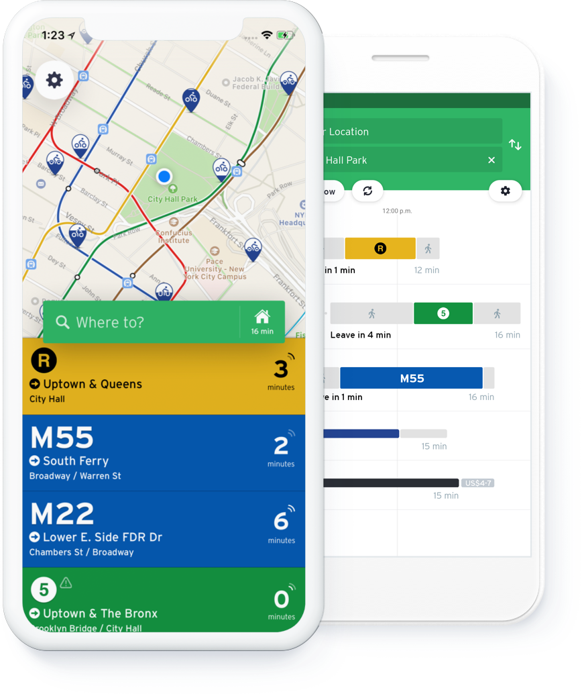

### Open source projects

Owner of the **[layoutBox](https://github.com/layoutBox)** organization. This organization includes all my open source projects that enables developpers to layout  views using Swift.

| Project | Description | GitHub Stars
| --- | --- | --- |
|  | [PinLayout](https://github.com/layoutBox/PinLayout): Extremely Fast views layouting without auto layout. No magic, pure code, full control and blazing fast. Concise syntax, intuitive, readable & chainable. PinLayout can layouts UIView, NSView and CALayer.| ~1900  |
|  | [FlexLayout](https://github.com/layoutBox/FlexLayout): FlexLayout adds a nice Swift interface to the highly optimized Yoga flexbox implementation. Concise, intuitive & chainable syntax. Flexbox is an incredible improvement over UIStackView. It is simpler to use, much more versatile and amazingly performant.|~1600 |
|  | [LayoutFrameworkBenchmark](https://github.com/layoutBox/LayoutFrameworkBenchmark): Benchmark the performances of various Swift layout frameworks (autolayout, UIStackView, PinLayout, LayoutKit, FlexLayout, Yoga, ...)| ~300  |
|  | [StackViewLayout](https://github.com/layoutBox/StackViewLayout): Fast StackView, Concise syntax, intuitive, readable & chainable. Stacks easily many views horizontally or vertically. Greatly inspired by Flexbox. **Still in development** | - |

 

### Job

[Transit](https://transitapp.com/) is a mobile app providing real-time public transit data. The app functions in over 175 metropolitan areas around the world. Transit was designed for aggregating and mapping real-time public transit data, crowdsourcing user data to determine the true location of buses and trains.

